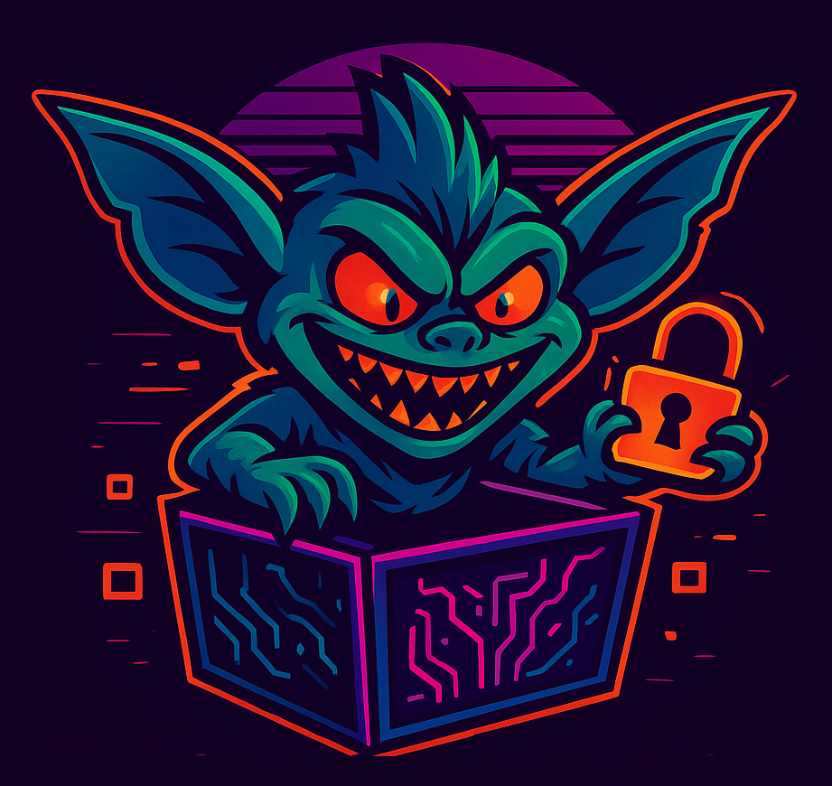

<!-- SPDX-License-Identifier: AGPL-3.0-or-later -->
<!-- SPDX-FileCopyrightText: 2025 GremlinBox Maintainer <simon@sigre.xyz> -->

# GremlinBox

GremlinBox is a collection of packages published across multiple package ecosystems for supply chain security testing and policy compliance evaluation. The packages are designed to exercise the detection capabilities of dependency scanners, licence enforcement tools, and supply chain security platforms in controlled tabletop exercises and pipeline validation runs.

## Package Categories

### Licence Packages

Licence packages cover the full spectrum of software licensing models. Each package implements a single SPDX-compatible licence, embedding the official licence text and exporting the correct SPDX identifier. The collection spans strong copyleft, weak copyleft, permissive, and non-permissive licences, including Creative Commons variants, hardware licences, and source-available licences.

These packages are intended for testing licence detection and policy enforcement tools. A scanner that inspects transitive dependencies should detect all licence categories represented in the collection.

### Malware Simulation Packages

Malware simulation packages contain benign code with strategically placed URL indicators drawn from well-known security testing endpoints. No harmful code is executed. The packages are designed to trigger detection by network-aware security tools, static URL scanners, and behaviour-based analysis platforms.

Six attack vector categories are represented:

- Network Indicators: HTTP endpoints associated with malware distribution and botnet exfiltration
- C2 Beacon: WebSocket channels associated with command and control communications
- Code Obfuscation: Hidden path URLs associated with concealed payloads
- Install-Time Execution: Installer and dropper URLs contacted during package installation
- Credential Harvesting: SSH, SFTP, and FTPS endpoints associated with credential exfiltration
- Cryptomining Indicators: FTP and FTPS endpoints associated with cryptomining infrastructure

Each malware simulation package also includes an install-time beacon hook (see Install-Time Execution below).

### Typosquatting Packages

Typosquatting packages are published under names that closely resemble commonly targeted legitimate packages. They are intended for testing name-proximity detection in dependency scanners and package audit tools. A scanner that flags typosquatting candidates should detect all packages in this category.

All typosquat packages include an install-time beacon hook (see Install-Time Execution below).

## Install-Time Execution

Many supply chain attack scenarios involve code that runs at package installation time rather than at import time. GremlinBox packages in the malware simulation and typosquatting categories include an install-time hook that makes a harmless GET request to a package-specific gremlinbox.sigre.xyz endpoint during installation. No data is collected beyond what a standard HTTP server log would record. The request fails silently if the endpoint is unreachable.

The beacon URL pattern is:

    https://gremlinbox.sigre.xyz/install/[slug]

For example, the C2 beacon package contacts:

    https://gremlinbox.sigre.xyz/install/c2-beacon

The typosquatting package targeting axios contacts:

    https://gremlinbox.sigre.xyz/install/typosquat-axois

Implementation by ecosystem:

- Python packages (PyGremlinBox): a setup.py CustomInstall hook runs the beacon request when pip executes the install phase
- npm packages (NPMGremlinBox): a postinstall script (postinstall.js) runs the beacon request via the Node.js https module when npm runs post-installation scripts
- Rust crates (RustGremlinBox): a build script (build.rs) runs the beacon request via the minreq crate when Cargo builds or installs the crate, including when it is built as a transitive dependency

Security scanners that monitor outbound HTTP requests during installation, or that inspect setup.py and package.json scripts for install-time execution patterns, will observe this behaviour.

## Dependencies

The collection is deliberately self-contained: no GremlinBox package depends on any third-party code. To provide a benign transitive dependency edge for dependency-graph and transitive-scanning tests, each malware simulation and typosquatting package declares a single dependency on the base package of its own ecosystem:

- Python packages depend on gremlinbox
- npm packages depend on @gremlinbox/base
- Rust crates depend on the gremlinbox crate

Licence packages and the base package itself declare no dependencies. Installing any hook package therefore pulls exactly one further GremlinBox package and nothing else.

## Package Ecosystems

### PyGremlinBox (Python)

PyGremlinBox provides the Python implementation of the GremlinBox package collection.

Packages in this sub-project:

- 65 licence packages (pygremlinbox-[licence], e.g. pygremlinbox-gpl-3-0)
- 6 malware simulation packages (pygremlinbox-malware-[category])
- 8 typosquatting packages (published under the typosquat name directly, e.g. reqeusts)
- 1 base squatter package (gremlinbox)

Source: PyGremlinBox/

### NPMGremlinBox (Node.js)

NPMGremlinBox provides the Node.js implementation of the GremlinBox package collection.

Packages in this sub-project:

- 65 licence packages (scoped as @gremlinbox/[slug], e.g. @gremlinbox/gpl-3-0)
- 6 malware simulation packages (@gremlinbox/malware-[category])
- 8 typosquatting packages (published under the typosquat name directly, e.g. axois, lodahs)
- 1 base squatter package (@gremlinbox/base)

Source: NPMGremlinBox/

### RustGremlinBox (Rust)

RustGremlinBox provides the Rust implementation of the GremlinBox package collection.

Packages in this sub-project:

- 65 licence crates (gremlinbox-[licence], e.g. gremlinbox-gpl-3-0)
- 6 malware simulation crates (gremlinbox-malware-[category])
- 8 typosquatting crates (published under the typosquat name directly, e.g. serd-serialize, tokoi-runtime), targeting popular crates such as serde and tokio
- 1 base squatter crate (gremlinbox)

Each malware simulation and typosquatting crate carries a build.rs install-time beacon hook (see Install-Time Execution above).

Note on the licence field: each licence crate sets `license = "<SPDX identifier>"` in Cargo.toml so scanners observe the identifier. `cargo build` does not validate this string; the exotic non-SPDX identifiers would require the `license-file` field instead only if the crate were published to a registry.

Source: RustGremlinBox/

The corpus is generated from the canonical mapping data and official licence texts by RustGremlinBox/generate.py, and validated by the RustGremlinBox/gremlinbox-tests crate.

### Further Ecosystems

Additional package ecosystems are planned for future releases.

## Package Interface

All packages across all ecosystems provide a standardised interface. The function names follow the conventions of each language but the semantics are consistent.

Core functions (all packages):

- getLicenceIdentifier / get_licence_identifier: returns the SPDX licence identifier for the package
- retrieveLicenceContent / retrieve_licence_content: returns the full text of the licence
- getPackageMetadata / get_package_metadata: returns a dictionary or object containing package name, version, and licence fields

Additional functions for malware simulation packages:

- getTestUrls / get_test_urls: returns the list of detection URLs associated with the package
- getAttackVector / get_attack_vector: returns the attack vector category string

Additional functions for typosquatting packages:

- getTyposquatTarget / get_typosquat_target: returns the name of the legitimate package being targeted
- getTyposquatVariant / get_typosquat_variant: returns the typosquat name under which this package is published

## Licensing

Project infrastructure (test scripts, mapping files, documentation) is licenced under AGPL-3.0-or-later. The full licence text is in the LICENCE file at the repository root.

Each individual package carries its own SPDX licence identifier appropriate to its category:

- Licence packages: the licence that the package implements (e.g. GPL-3.0, MIT, CC-BY-SA-4.0)
- Malware simulation packages: AGPL-3.0-or-later
- Typosquatting packages: AGPL-3.0-or-later

Refer to the LICENCE file within each package directory for the applicable terms.

## Licence

This project is licenced under the GNU Affero General Public License v3.0 or later (AGPL-3.0-or-later). See the LICENCE file for the full licence text.

This software is provided for security testing and educational purposes only. Use in accordance with your organisation's security testing policies and applicable laws.
